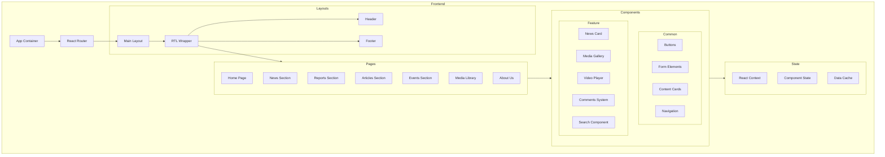
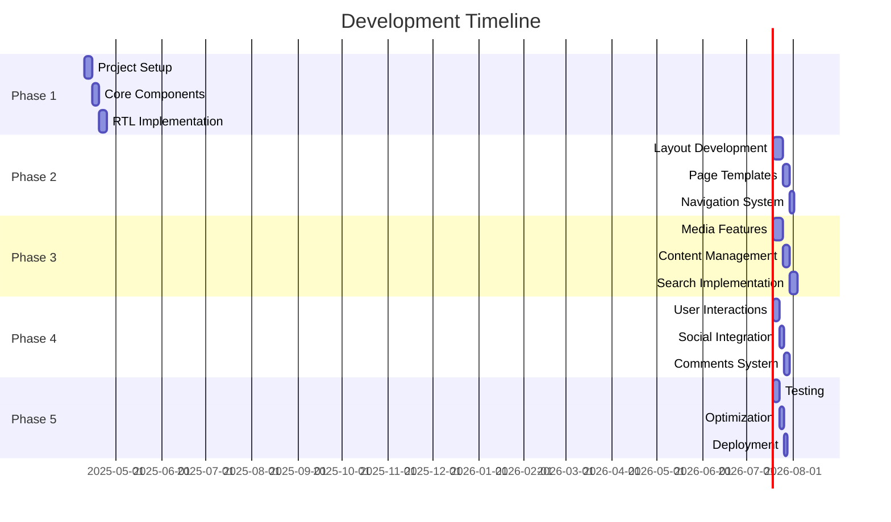
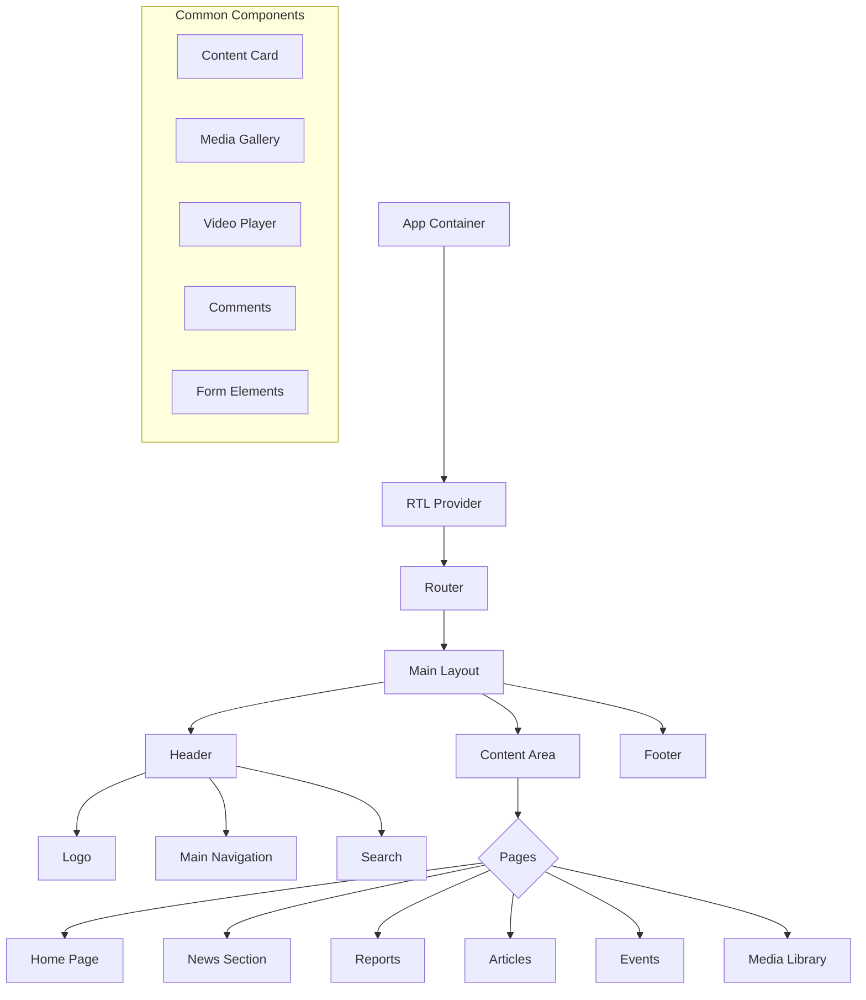

# Implementation Plan

## Project Architecture



## Development Phases



## Component Hierarchy



## Implementation Steps

### Phase 1: Project Setup (Week 1)
1. Initialize React project with Vite
   ```bash
   npm create vite@latest naso-media -- --template react
   cd naso-media
   npm install
   ```

2. Install core dependencies
   ```bash
   npm install react-router-dom @emotion/react @emotion/styled
   npm install react-query axios i18next react-i18next
   ```

3. Set up RTL support
   - Configure i18next
   - Set up RTL styles
   - Create base layout components

### Phase 2: Core Development (Week 2)
1. Create component library
   - Implement design system
   - Build reusable components
   - Set up storybook for documentation

2. Develop page templates
   - Create layout structures
   - Implement responsive design
   - Build navigation system

### Phase 3: Feature Implementation (Week 3-4)
1. Media features
   - Image gallery
   - Video player
   - File upload system

2. Content management
   - Article editor
   - Media manager
   - Category system

### Phase 4: User Interaction (Week 5)
1. Comments system
2. Social sharing
3. Search functionality
4. User preferences

### Phase 5: Optimization (Week 6)
1. Performance optimization
2. SEO implementation
3. Testing and bug fixes
4. Deployment preparation

## Next Steps

1. Get approval for the implementation plan
2. Set up development environment
3. Create initial project structure
4. Begin Phase 1 implementation

Would you like me to proceed with writing this plan to a file and then switch to Code mode to begin implementation?